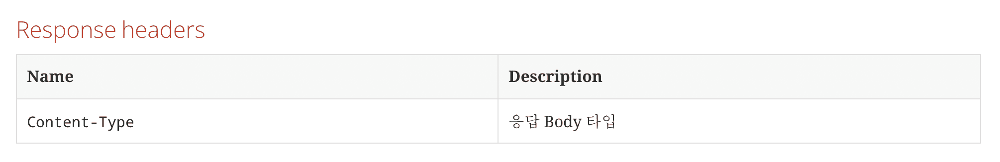

# [Spring] Spring Rest Docs

> `API`를 개발하게 되면 해당 `API`의 요청 및 응답 값들에 대한 스펙 정의를 해서 문서화를 꼭 해야합니다.  
> 이렇게 문서화를 해야 `Client`에서 해당 `API`가 어떤 기능을 하는지 이해하고 사용할 수 있기 때문입니다.  
> 하지만, 문서화는 굉장히 반복적이고 귀찮은 일입니다. (프로그래머는 참지 않아)
>
> `Spring Rest Docs`는 이런 문서화를 테스트 코드를 작성하면 자동으로 만들어 주는 `Spring 공식 문서자동화 라이브러리` 입니다.

## Gradle 설정

`Spring Rest Docs`를 사용하기 위해서는 의존성을 추가한 뒤, `build`시 처리할 로직을 추가로 작성해야합니다.

### 전체 코드

```groovy
plugins {
    id 'org.springframework.boot' version '2.6.3'
    id 'io.spring.dependency-management' version '1.0.11.RELEASE'
    id 'org.asciidoctor.jvm.convert' version '3.3.2' // 추가
    id 'java'
}

group = 'com.jojiapp'
version = '0.0.1-SNAPSHOT'
sourceCompatibility = '17'

configurations {
    compileOnly {
        extendsFrom annotationProcessor
    }
    asciidoctorExtensions // 추가
}

repositories {
    mavenCentral()
}

ext {
    set('snippetsDir', file('build/generated-snippets'))
    set('documentDir', file('src/main/resources/static/docs')) // 추가
    set('bootJarDocumentPath', 'static/docs') // 추가
}

dependencies {
    implementation 'org.springframework.boot:spring-boot-starter-hateoas'
    implementation 'org.springframework.boot:spring-boot-starter-web'
    implementation 'org.springframework.boot:spring-boot-starter-data-jpa'
    annotationProcessor 'org.projectlombok:lombok'
    asciidoctorExtensions 'org.springframework.restdocs:spring-restdocs-asciidoctor' // 추가
    testImplementation 'org.springframework.boot:spring-boot-starter-test'
    testImplementation 'org.springframework.restdocs:spring-restdocs-mockmvc' // 추가
}

jar {
    enabled false
}

clean {
    delete documentDir
}

test {
    outputs.dir snippetsDir
    useJUnitPlatform()
}

asciidoctor {
    doFirst {
        delete documentDir
    }

    configurations('asciidoctorExtensions')
    inputs.dir snippetsDir
    dependsOn test
}

bootJar {
    dependsOn asciidoctor
    from("${asciidoctor.outputDir}") {
        into bootJarDocumentPath
    }
}

task copyDocument(type: Copy) {
    dependsOn asciidoctor
    from file("${asciidoctor.outputDir}")
    into documentDir
}

build {
    dependsOn copyDocument
}
```

- `Gradle7.x` 버전 부터 `org.asciidoctor.convert` 플러그인은 사용할 수 없는 관계로 `org.asciidoctor.jvm.convert` 라이브러리를 사용합니다.

### Configurations

```groovy
configurations {
    compileOnly {
        extendsFrom annotationProcessor
    }
    asciidoctorExtensions
}
```

- `extendsFrom annotationProcessor ~`: `lombok` 같은 라이브러리를 사용하기 위함 입니다.
- `asciidoctorExtensions`: 추후 `operation`과 `{snippets}`을 사용하기 위한 설정 과정입니다.

### Ext

```groovy
ext {
    set('snippetsDir', file('build/generated-snippets')) // 추가
    set('documentDir', file('src/main/resources/static/docs')) // 추가
    set('bootJarDocumentPath', 'static/docs') // 추가
}
```

- `snippetsDir`: `Snippets`이 생성 될 위치 입니다.
- `documentDir`': 문서가 복사 될 위치 입니다.
    - 로컬에서 문서를 확인하기 위한 용도
- `bootJarDocumentPath`: `jar`파일로 패키징 시 문서를 복사할 위치 입니다.
    - 배포 시, 문서를 볼 수 있도록 하기 위한 용도

> `Snippets`은 테스트 코드를 통해 생성된 문서 조각입니다. `Snippets`을 조합해 문서를 만들 수 있습니다.

### Dependencies

```groovy
dependencies {
    implementation 'org.springframework.boot:spring-boot-starter-hateoas'
    implementation 'org.springframework.boot:spring-boot-starter-web'
    implementation 'org.springframework.boot:spring-boot-starter-data-jpa'
    annotationProcessor 'org.projectlombok:lombok'
    asciidoctorExtensions 'org.springframework.restdocs:spring-restdocs-asciidoctor' // 추가
    testImplementation 'org.springframework.boot:spring-boot-starter-test'
    testImplementation 'org.springframework.restdocs:spring-restdocs-mockmvc' // 추가
}
```

- `annotationProcessor`: `lombok`을 사용하기 위해 추가합니다.
- `asciidoctorExtensions 'org.springframework.restdocs:spring-restdocs-asciidoctor'`
    - `configurations` 설정과 한 묶음으로, 해당 라이브러리를 추가해야 `operation`과 `{snippets}`을 사용할 수 있습니다.
- `testImplementation 'org.springframework.restdocs:spring-restdocs-mockmvc'`
    - 테스트 코드를 작성하면 문서 조각을 생성해시켜주는 라이브러리입니다.
- `implementation 'org.springframework.boot:spring-boot-starter-hateoas'`
    - `HATEOAS`도 간단하게 적용해보기 위해 추가하였습니다.

### Tasks

#### Jar

```groovy
jar {
    enabled false
}
```

- `enabled true`로 설정(기본 값)하면 `plain jar`파일을 만들어 줍니다. 현재는 필요 없으니 `false`로 설정 하였습니다.

#### Test

```groovy
test {
    outputs.dir snippetsDir
    useJUnitPlatform()
}
```

- `Test`가 완료되면 `Snippets`이 생기는데, 해당 `Snippets`이 생성될 위치를 지정합니다,

#### Asciidoctor

```groovy
asciidoctor {
    doFirst {
        delete documentDir
    }

    configurations('asciidoctorExtensions')
    inputs.dir snippetsDir
    dependsOn test
}
```

- `doFirst`: 생성된 문서를 해당 위치에 복사하고 있기 때문에(`아래 Task`에서 할 예정) `asciidoctor`이 실행 되면 먼저 해당 위치의 파일을 삭제합니다.
    - 최신 문서로 유지하기 위함입니다.
- `configurations`에 위에서 설정한 `asciidoctorExtensions`를 넣어줍니다.
    - 이렇게 함으로써, `Asciidoc`파일에서 `operation`과 `{snippets}`을 사용할 수 있게 됩니다.
- `inputs.dir snippetsDir`: `Snippets` 위치를 지정합니다.
- `dependsOn test`: 해당 `Task`실행 이전에 `test`를 먼저 실행합니다.

#### BootJar

```groovy
bootJar {
    dependsOn asciidoctor
    from("${asciidoctor.outputDir}") {
        into bootJarDocumentPath
    }
}
```

- `bootJar`는 실행 가능한 `jar`파일입니다.
- `from ~ into`: 해당 파일이 생성 되는 시점에 우리가 만든 문서를 `static/docs`위치에 복사하여 줍니다.
    - 복사하지 않으면 배포 시 문서를 볼 수 없습니다.
- `dependsOn asciidoctor`: `asciidoctor`가 실행되어야 문서가 존재하므로 `asciidoctor` 뒤에 실행되도록 합니다.

> 여러 블로그들을 보면 복사 경로가 `BOOT-INF/classes/static/docs`라고 되어있는데, 해당 경로가 아닌 `static/docs`로 해줘야합니다.

#### CopyDocument(Custom)

```groovy
task copyDocument(type: Copy) {
    dependsOn asciidoctor
    from file("${asciidoctor.outputDir}")
    into documentDir
}
```

- `copyDocument`: `bootJar`를 통해 배포 시에는 문서가 포함되도록 하였습니다만, `IntelliJ`같은 `Tool`에서 실행하면 존재하지 않는 경로(`404`)가 뜹니다.  
  그렇기 때문에 `src/main/resources/static/docs`에 문서를 복사하여 볼 수 있도록 만들어 줍니다.

#### Build

```groovy
build {
    dependsOn copyDocument
}
```

- `build`되기 이전에 `src/main/resources/static/docs`에 복사 되도록 설정합니다.

#### Clean

```groovy
clean {
    delete documentDir
}
```

- `clean`을 실행하면 `src/main/resources/static/docs` 폴더를 삭제 함으로써, `build`시 깔끔히 새로운 문서를 볼 수 있습니다.

## 문서화에 사용되는 메소드

> `타입`과 `필수값`은 `Custom`을 통해 만들수 있습니다. (`type`은 기본적용인 곳도 있음)  
> `Custom`하는 방법에 대해서는 다음장에서 자세하게 다루겠습니다.

`typeAttr` `defaultAttr` 두 메소드는 제가 만든 메소드 입니다. 아래 예시 코드에 있습니다.

### Document

- `MockMvcRestDocumentation.document`: 문서 작성은 해당 메소드 안에서 이루어줘야 합니다.
    - 첫 번째 인자로는 `snippets`이 생성될 폴더 경로를 지정해 줍니다.
    - 두 번째 인자부터 각 `요청` 및 `응답`에 대해 정의합니다. (`아래 메소드 참조`)

```java
result.andDo(document("accounts/find-all",...)
```

### Request Headers

- `HeaderDocumentation.requestHeader`: `Request Headers`를 정의합니다.
    - `HeaderDocumentation.headerWithName`: 각 `Header`에 대한 정의를 합니다.

```java
requestHeaders(
        headerWithName(HttpHeaders.CONTENT_TYPE).description("요청 Body 타입"),
        headerWithName(HttpHeaders.ACCEPT).description("기대 응답 Body 타입")
        )
```


### Path Parameters

- `RequestDocumentation pathParameters`': `Path Parameters`를 정의합니다.
    - `RequestDocumentation.parameterWithName`: 각 `Path Parameter`에 대해 정의합니다.


### Request Parameters

- `RequestDocumentation.requestParameters`: `Request Parameters`를 정의합니다.
    - `RequestDocumentation.parameterWithName`: 각 `Parameter`에 대해 정의합니다.

```java
requestParameters(
        parameterWithName("page").description("페이지 번호 (0부터 시작)").attributes(typeAttr(JsonFieldType.NUMBER)).optional(),
        parameterWithName("size").description("개수").attributes(typeAttr(JsonFieldType.NUMBER)).attributes(defaultAttr(20)).optional(),
        parameterWithName("sort").description("정렬 {fieldName,asc|desc}").attributes(typeAttr(JsonFieldType.STRING)).optional()
        ),
```


### Request Fields

- `PayloadDocumentation.requestFields`: `Request Fields`를 정의합니다.
    - `PayloadDocumentation.fieldWithPath`: 각 `Field`에 대해 정의합니다.

```java
requestFields(
        fieldWithPath("name").description("이름").type(JsonFieldType.STRING),
        fieldWithPath("age").description("나이").type(JsonFieldType.NUMBER)
        )
```


### Response Headers

- `HeaderDocumentation.responseHeaders`: `Response Headers`를 정의합니다.
    - `HeaderDocumentation.headerWithName`: 각 `Response Header`를 정의합니다.

```java
responseHeaders(
        headerWithName(HttpHeaders.CONTENT_TYPE).description("응답 Body 타입")
        ),
```



### Response Fields

- `PayloadDocumentation.responseFields`: `Response Fields`를 정의합니다.
    - `PayloadDocumentation.fieldWithPath`: 각 `Field`를 정의합니다.


### Links

`HATEOAS`를 적용 중이라면, `Links`에 대해서도 작성할 수 있습니다.

- `HypermediaDocumentation.links`: `Links`를 정의합니다.
    - `HypermediaDocumentation.linkWithRel`: 각 `Link`에 대해 정의합니다.

```java
links(
        linkWithRel("self").description("요청 API 링크"),
        linkWithRel("profile").description("요청 API 문서 링크")
        ),
```


> `Links`의 경우 이렇게 정의 하더라도, `Response Fields` 부분에서 한 번 더 정의해야 합니다. (불편)

## Test 작성 예시

`Test`코드를 작성해야 해당 `Test 코드`를 기반으로 `snippet`을 생성해줍니다.

`Rest API`는 작성되어 있다고 가정하고 하겠습니다.

### Rest Docs Config

기본적으로 `Json 응답 값`이 한줄로 보이기 때문에, `Json` 객체로 보기 이쁘게 하는 설정을 해줍니다.

```java

@TestConfiguration
public class SpringRestDocsConfig {

    @Bean
    public RestDocsMockMvcConfigurationCustomizer restDocsMockMvcConfigurationCustomizer() {
        return (it) -> {
            it.operationPreprocessors()
                    .withRequestDefaults(Preprocessors.prettyPrint())
                    .withResponseDefaults(Preprocessors.prettyPrint());
        };
    }
}

```

```java

@WebMvcTest(AccountApi.class)
@AutoConfigureRestDocs
@Import(SpringRestDocsConfig.class)
@DisplayNameGeneration(DisplayNameGenerator.ReplaceUnderscores.class)
class AccountApiTest {

    @Autowired
    private MockMvc mockMvc;

    @Autowired
    private ObjectMapper objectMapper;

    @MockBean
    private AccountService accountService;

    private Attributes.Attribute defaultAttr(int value) {
        return new Attributes.Attribute("defaults", value);
    }

    private Attributes.Attribute typeAttr(JsonFieldType type) {
        return new Attributes.Attribute("types", type);
    }

    @Test
    void 계정을_정상적으로_전체조회하면_200상태를_받는다() throws Exception {
        // given
        var api = "/api/accounts";

        int page = 1;
        int size = 5;

        var params = new LinkedMultiValueMap<String, String>();
        params.add("page", Integer.toString(page));
        params.add("size", Integer.toString(size));
        params.add("sort", "id,asc");

        var accountResponses = List.of(new AccountResponse(1L, "jojiapp", 26));
        var apiResponse = ApiResponse.of(accountResponses);

        var pageable = PageRequest.of(page, size, Sort.by("id").ascending());
        given(accountService.findAll(pageable)).willReturn(accountResponses);

        // when
        var result = mockMvc.perform(get(api)
                .contentType(MediaType.APPLICATION_JSON)
                .accept(MediaType.APPLICATION_JSON)
                .params(params)
        );

        // then
        result.andDo(print())
                .andExpect(status().isOk())
                .andExpect(content().json(objectMapper.writeValueAsString(apiResponse)))
                .andDo(document("accounts/find-all",
                        requestHeaders(
                                headerWithName(HttpHeaders.CONTENT_TYPE).description("요청 Body 타입"),
                                headerWithName(HttpHeaders.ACCEPT).description("응답 Body 타입")
                        ),
                        requestParameters(
                                parameterWithName("page").description("페이지 번호 (0부터 시작)").attributes(typeAttr(JsonFieldType.NUMBER)).optional(),
                                parameterWithName("size").description("개수").attributes(typeAttr(JsonFieldType.NUMBER)).attributes(defaultAttr(20)).optional(),
                                parameterWithName("sort").description("정렬 {fieldName,asc|desc}").attributes(typeAttr(JsonFieldType.STRING)).optional()
                        ),
                        responseHeaders(
                                headerWithName(HttpHeaders.CONTENT_TYPE).description("응답 Body 타입")
                        ),
                        responseFields(
                                fieldWithPath("body[0].id").description("계정 고유 아이디").type(JsonFieldType.NUMBER),
                                fieldWithPath("body[0].name").description("이름").type(JsonFieldType.STRING),
                                fieldWithPath("body[0].age").description("나이").type(JsonFieldType.NUMBER)
                        )
                ));
    }
}
```

- `@WebMvcTest(AccountApi.class)`: 해당 `Controller`만 간단하게 테스트 하기 위해서 `@WebMvcTest`를 사용했습니다.
- `@AutoConfigureRestDocs`: `Rest Docs`와 관련된 설정을 자동으로 해주는 어노테이션입니다. 추가하지 않을 시, 문서작성이 되지 않으므로 꼭 추가합니다.
- `@Import(SpringRestDocsConfig.class)`: 위에서 만든 설정파일을 추가합니다.
- `@DisplayNameGeneration(DisplayNameGenerator.ReplaceUnderscores.class)`: 테스트 메소드명의 구분자 `_`를 공백으로 치환시켜 주는 어노테이션입니다.
- `MockMvc`: 가짜 요청을 보내기 위한 객체 입니다.
    - `mockMvc.perform()` 메소드를 통해 `API`요청을 보낼 수 있습니다.
    - `HTTP Method`는 `MockMvcRequestBuilders`클래스와 `RestDocumentationRequestBuilders`로 나뉘는데, 테스트 결과 둘 다 사용 가능합니다. (
      저는 `RestDocumentationRequestBuilders`를 사용했습니다.)

> 테스트를 실행 시켜보면 `build/generated-snippets/accounts/find-all` 위치에 `snippets`이 생기는것을 확인할 수 있습니다.
---

## 참고 사이트

- [Spring Rest Docs 공식 사이트](https://docs.spring.io/spring-restdocs/docs/current/reference/html5/)
- [[Spring] Spring rest docs 적용기(gradle 7.0.2)](https://velog.io/@max9106/Spring-Spring-rest-docs%EB%A5%BC-%EC%9D%B4%EC%9A%A9%ED%95%9C-%EB%AC%B8%EC%84%9C%ED%99%94)
- [Configure a Gradle 7 compatible version of Asciidoctor's Gradle plugin in projects using REST Docs #676](https://github.com/spring-io/start.spring.io/issues/676)
- [Asciidoc 기본 사용법](https://narusas.github.io/2018/03/21/Asciidoc-basic.html)
- [[BE/2주차] Spring Rest Docs 적용기 (3)](https://velog.io/@hydroniumion/BE2%EC%A3%BC%EC%B0%A8-Spring-Rest-Docs-%EC%A0%81%EC%9A%A9%EA%B8%B0-3#%EC%9E%90%EC%A3%BC-%EC%93%B0%EC%9D%B4%EB%8A%94-%ED%8F%AC%EB%A7%B7-%EC%98%88%EC%8B%9C%EC%97%B4%EC%96%B4%EC%84%9C-%EC%9D%BD%EC%96%B4%EB%B3%B4%EC%84%B8%EC%9A%94)
- [[스프링 기반 REST API 개발] 3-6. 스프링 REST Docs: 문서 빌드](https://freedeveloper.tistory.com/197)
- [REST API Guide](https://github.com/freespringlecture/spring-rest-api-study/blob/chap03-06_rest-docs-build/src/main/asciidoc/index.adoc)